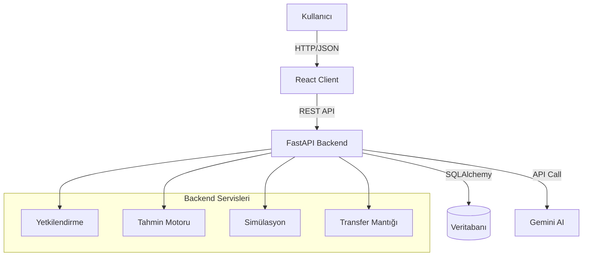

# Retail Decision Support System (RetailDSS)


RetailDSS, perakende zincirleri için geliştirilmiş, **Yapay Zeka (AI)** ve **Veri Odaklı** modern bir karar destek sistemidir. Geleneksel stok yönetiminin ötesine geçerek; dinamik talep tahmini, senaryo tabanlı simülasyonlar ve akıllı transfer önerileri ile işletmelerin verimliliğini maksimize eder.


---

## 📋 İçindekiler
- [Özellikler](#-özellikler)
- [Teknoloji Stack'i](#-teknoloji-stacki)
- [Kurulum](#-kurulum)
  - [Ön Gereksinimler](#ön-gereksinimler)
  - [Backend Kurulumu](#backend-kurulumu)
  - [Frontend Kurulumu](#frontend-kurulumu)
  - [Veritabanı Oluşturma](#veritabanı-oluşturma)
- [Kullanım](#-kullanım)
- [Proje Mimarisi](#-proje-mimarisi)
- [Gelişmiş Konular](#-gelişmiş-konular)
- [Katkıda Bulunma](#-katkıda-bulunma)

---

## 🌟 Özellikler

### 1. 🔮 AI Destekli Talep Tahmini
Geçmiş satış verilerini analiz ederek gelecek dönem satışlarını tahmin eder.
- **Lineer Regresyon** ve **Moving Average** modelleri.
- **Cold Start:** Yeni ürünler için benzer kategori verileriyle tahminleme.

### 2. 🌪️ Simülasyon Motoru (Scenario Planning)
"What-If" analizleri ile stratejik kararlar almanızı sağlar.
- **Ekonomik Kriz:** Fiyat esnekliği ve talep düşüşü senaryosu.
- **Talep Patlaması:** Kampanya dönemleri simülasyonu.
- **Formül:** $D_{new} = D_{base} \times (1 + \epsilon \times \Delta P) \times S_{seasonality}$

### 3. 🏹 Robin Hood Transfer Algoritması
Stok optimizasyonu için mağazalar arası otomatik transfer önerileri.
- **Zenginden Fakire:** Stok fazlası olan mağazadan eksiği olana transfer.
- Lojistik maliyet minimizasyonu.

### 4. 🗺️ Mekansal Analiz (Spatial Intelligence)
Mağazaların coğrafi performansını harita üzerinde görselleştirir.
- **Isı Haritaları (Heatmaps):** Ciro ve karlılık yoğunluğu.
- **Risk Analizi:** Rakip mağaza yoğunluğuna göre risk puanlaması.

### 5. 💬 Text-to-SQL Asistanı (Gemini AI)
Doğal dil ile veritabanı sorgulama.
- *"Geçen ay en çok ciro yapan 3 mağaza hangisi?"* sorusunu saniyeler içinde SQL sorgusuna ve rapora dönüştürür.
- Güvenli sorgu (Read-Only) modu.

---

## 🛠 Teknoloji Stack'i

### Backend
- **Framework:** [FastAPI](https://fastapi.tiangolo.com/) (Yüksek performanslı, asenkron API)
- **Veritabanı:** [SQLAlchemy](https://www.sqlalchemy.org/) (ORM), SQLite (Dev), PostgreSQL (Prod)
- **Veri Analitiği:** Pandas, NumPy, Scikit-Learn
- **AI/LLM:** Google Gemini API
- **Güvenlik:** SlowAPI (Rate Limiting), Pydantic

### Frontend
- **Core:** [React 19](https://react.dev/), [Vite](https://vitejs.dev/)
- **Styling:** [TailwindCSS v4](https://tailwindcss.com/)
- **Görselleştirme:** Recharts (Grafikler), React-Leaflet (Harita), Mermaid.js (Diyagramlar)
- **Editör:** Monaco Editor (VS Code benzeri SQL editörü)

---

## 🚀 Kurulum

### Ön Gereksinimler
- Python 3.9 veya üzeri
- Node.js 18 veya üzeri
- Git

### Backend Kurulumu

1. Projeyi klonlayın:
   ```bash
   git clone https://github.com/kullaniciadi/retail-dss-project.git
   cd retail-dss-project/backend
   ```

2. Sanal ortam (venv) oluşturun ve aktif edin:
   ```bash
   # Windows
   python -m venv venv
   .\venv\Scripts\activate
   
   # Mac/Linux
   python3 -m venv venv
   source venv/bin/activate
   ```

3. Bağımlılıkları yükleyin:
   ```bash
   pip install -r requirements.txt
   ```

4. `.env` dosyasını oluşturun:
   `backend` klasöründe `.env` adında bir dosya oluşturun ve içine şu bilgileri ekleyin:
   ```env
   DATABASE_URL=sqlite:///./retail_dss.db
   GEMINI_API_KEY=AI_API_ANAHTARINIZ_BURAYA
   WEATHER_API_KEY=OPSIYONEL
   ```

### Frontend Kurulumu

1. Frontend klasörüne geçin:
   ```bash
   cd ../frontend
   ```

2. Paketleri yükleyin:
   ```bash
   npm install
   ```
   *(Not: `--legacy-peer-deps` gerekebilir)*

### Veritabanı Oluşturma

Backend klasörüne dönün ve başlangıç komutunu çalıştırın:
```bash
python init_db_v2.py
```
Bu komut veritabanı tablolarını oluşturacak ve örnek (seed) verileri yükleyecektir.

---

## ▶️ Kullanım

### Backend'i Başlatma
```bash
# backend klasöründe
uvicorn main:app --reload
```
API şu adreste çalışacaktır: `http://localhost:8000`
Swagger Dokümantasyonu: `http://localhost:8000/docs`

### Frontend'i Başlatma
```bash
# frontend klasöründe
npm run dev
```
Uygulama şu adreste açılacaktır: `http://localhost:5173`

---

## 🏗 Proje Mimarisi



### Veritabanı Şeması (Basitleştirilmiş)
Proje, **Yıldız Şema (Star Schema)** benzeri bir yapı kullanır:
- **Sales (Satışlar):** Ana işlem tablosu.
- **Stores, Products, Customers:** Boyut (Dimension) tabloları.
- **Inventory:** Anlık stok durumu.

---

## 🧠 Gelişmiş Konular

### Simülasyon Mantığı
Ekonomik senaryoları modellemek için parametrik formüller kullanılır.
> **Yeni Talep ($D_{new}$)** = $D_{base} \times (1 + \epsilon \times \Delta P) \times S_{seasonality}$

### Prompt Engineering
AI asistanı, **Few-Shot Learning** tekniği ile eğitilmiştir. Modele veritabanı şeması bağlam (context) olarak verilir ve sadece `SELECT` sorguları üretmesi için kısıtlanmıştır (Safety Guardrails).

### Performans
- Sık kullanılan sorgular `lru_cache` ile önbelleğe alınır.
- Büyük veri setleri için `pandas` vektörel operasyonları kullanılır.

---

## 🤝 Katkıda Bulunma
Katkılarınızı bekliyoruz! Lütfen önce bir issue açarak tartışın, ardından Pull Request gönderin.

1. Forklayın.
2. Feature branch oluşturun (`git checkout -b feature/YeniOzellik`).
3. Commit leyin (`git commit -m 'Yeni özellik eklendi'`).
4. Pushlayın (`git push origin feature/YeniOzellik`).
5. Pull Request açın.

---

## 📄 Lisans
Bu proje [MIT Lisansı](LICENSE) ile lisanslanmıştır.
